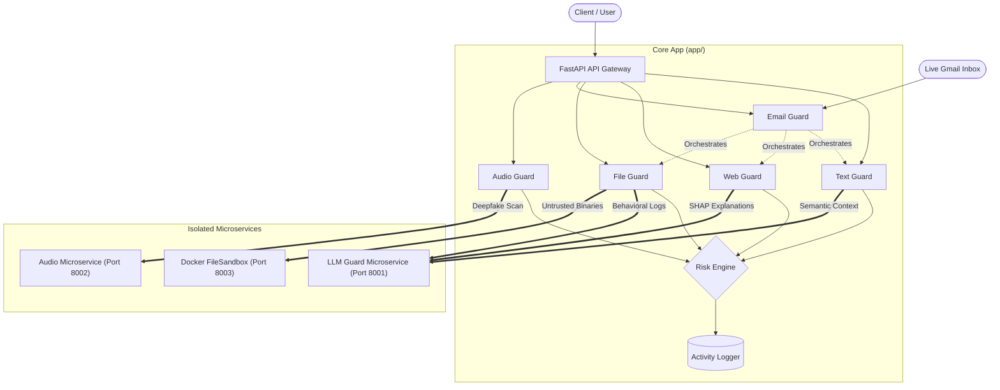

# 🛡️ GenAi-Guard: Deep-Learning Powered Cybersecurity Framework

> **A comprehensive, multi-layered, and AI-driven cybersecurity platform designed to protect applications and end-users from sophisticated zero-day threats.** 

GenAi-Guard surpasses traditional signature-based security by combining classical Machine Learning (XGBoost/Random Forest) for rapid pattern recognition with the deep semantic understanding of Large Language Models (offline LLaMA 3 integration). It operates as a coordinated suite of microservices, analyzing text, emails, web links, browser cookies, voice audio, and raw files in real-time.

---

## 🌟 The Philosophy & Approach

Modern cyber threats—such as highly convincing AI-generated phishing, zero-day malware, and LLM prompt injections—easily bypass static rule-based filters. GenAi-Guard addresses this by employing a **Hybrid AI Strategy**:
1.  **Speed & Statistical Analysis:** Lightweight ML models (like our custom XGBoost URL classifier) process requests in milliseconds, checking mathematical feature distributions.
2.  **Semantic Deep-Scans:** Complex, ambiguous, or highly suspicious payloads are routed to an isolated, locally-hosted LLM. The LLM acts as an expert cybersecurity analyst, evaluating the *intent* and *context* of the payload, not just its syntax.
3.  **Explainable AI (XAI):** Security alerts are often overly technical. GenAi-Guard uses SHAP (SHapley Additive exPlanations) alongside the LLM to translate complex risk factors (e.g., "abnormal DOM structure") into clear, actionable advice for non-technical users.
4.  **Privacy-First Execution:** The entire analysis pipeline, including the LLaMA 3 model, runs locally. A dedicated `PIIScrubber` intercepts all data before logging or analysis, guaranteeing that sensitive information (API keys, SSNs, credit cards) never leaks.

---

## 🏗️ System Architecture

The ecosystem is built on a scalable FastAPI backend, separating concerns into specialized functional modules and isolated microservices.



---

## 🔬 Core Security Modules

### 1. 🔤 Text Guard (Prompt & Text Security)
**Endpoint:** `POST /text/analyze`

The Text Guard acts as the first line of defense against malicious textual payloads. Unlike basic regex filters, it uses the LLM microservice to understand the semantic intent behind the text.
*   **Prompt Injection & Jailbreak Detection:** Specifically trained to identify adversarial prompts that attempt to hijack AI system instructions, leak system prompts, or bypass safety guardrails.
*   **Semantic Phishing Detection:** Analyzes text for manipulative language, unwarranted urgency, or deceptive framing typical of Advanced Persistent Threat (APT) phishing campaigns.
*   **DLP (Data Loss Prevention):** Scans for exposed credentials, API keys, passwords, and PII, preventing accidental leaks in outgoing or incoming data streams.
*   **Pre-logging Anonymization:** Every request is instantly processed by the `PIIScrubber`. Email addresses, phone numbers, and financial data are replaced with tags like `[CREDIT_CARD_REDACTED]` before hitting any log file.

### 2. 🌐 Web Guard (Comprehensive URL & Session Protection)
**Endpoint:** `POST /web/scan`

Web Guard provides real-time protection against malicious infrastructure and session hijacking attempts through a dual-stage pipeline.

**Stage A: Advanced URL Phishing Detection**
When a URL is submitted, the system doesn't just check a blacklist; it analyzes the site's DNA.
1.  **Real-Time DOM Extraction:** A live scraper temporarily fetches the site, extracting 22 engineered features (e.g., ratio of external scripts, presence of hidden iframes, SSL certificate validity).
2.  **Machine Learning Classification:** These features are passed through a `StandardScaler` and into a custom-trained **XGBoost** model.
3.  **Typosquatting Checks:** Algorithms flag domains intentionally misspelled to mimic major brands (e.g., `g00gle.com`).
4.  **HuggingFace Failsafe:** If the primary model encounters an error, the system seamlessly fails over to a pre-trained `elftsdmr/malicious-url-detection` NLP pipeline.

**Stage B: Cookie Integrity & XSS Analysis**
Web Guard inspects HTTP cookies for embedded attack vectors:
*   **Payload Regex Matching:** Scans for SQL Injection (SQli) syntax and Cross-Site Scripting (XSS) payloads.
*   **Obfuscation Reversal:** Automatically detects and decodes Base64 payloads hidden inside cookies, recursively scanning the decoded output for threats.

### 3. 📧 Email Guard (The Threat Orchestrator)
**Endpoint:** `POST /email/scan-eml` | **Background Worker:** `gmail_sync.py`

Email Guard acts as the central conductor, disassembling complex `.eml` and `.msg` files and routing their components to the appropriate specialized guards.
*   **Body Text:** Sent to Text Guard for semantic analysis.
*   **Extracted Links:** Sent to Web Guard for real-time reputation and feature analysis.
*   **Attachments:** Sent to File Guard for sandbox execution and content extraction.

**Live Gmail Integration (Continuous Monitoring):**
The `gmail_sync.py` worker uses Google's OAuth 2.0 API to actively poll an inbox. Every 10 seconds, it fetches unread messages, processes them through the entire GenAi-Guard ecosystem, and makes autonomous decisions. Emails scoring above the `HIGH_RISK` threshold are automatically stripped of their unread status and quarantined into the SPAM folder to protect the end-user.

### 4. 📁 File Guard (Behavioral Sandbox & Content Scanner)
**Endpoint:** `POST /file/scan-file`

File Guard prevents malware infections by executing suspicious files in a strictly controlled environment, combined with deep content inspection.

**Phase 1: Safe Content Extraction**
Before a binary or document is ever executed, File Guard attempts to safely extract its text. It natively parses `.pdf`, `.docx`, and `.html` files. This extracted plain text is then fired off in three concurrent, asynchronous LLM tasks to scan for hidden phishing links, injected prompts, or leaked credentials.

**Phase 2: The Docker Sandbox**
The file is moved into a highly restricted, ephemeral Docker container (`sandbox-image`):
*   **Constrained Resources:** Hard limits of 256MB RAM and 1 CPU core prevent denial-of-service or crypto-mining scripts from bogging down the host.
*   **Syscall Tracing (`strace`):** The system monitors exactly what the file tries to do. Did it attempt to read `/etc/passwd`? Did it spawn a hidden `/bin/bash` shell?
*   **Network Capture (`tcpdump`):** If network access is temporarily permitted, the sandbox captures all external IP/Port connection attempts (often revealing Command & Control servers).
*   **LLM Behavioral Analysis:** The resulting logs are parsed into JSON and fed to the LLM. The LLM acts as a malware reverse-engineer, summarizing the file's behavior and issuing a final risk score based on its actions. Once complete, the container is destroyed.

### 5. 🎙️ Audio Guard (Deepfake & Voice Clone Detection)
**Endpoint:** `POST /audio/detect-voice`

Audio Guard acts as a defense against AI-generated voice scams and deepfakes. It operates by analyzing the acoustic properties of an uploaded voice file, coordinating with its isolated microservice.
*   **Acoustic Feature Extraction:** Uses `librosa` to extract MFCC (Mel-frequency cepstral coefficients) features, analyzing the hidden vocal signatures of an audio clip.
*   **Machine Learning Classification:** The extracted audio vectors are evaluated by a custom-trained Machine Learning model (Random Forest) which accurately differentiates natural human speaking variance versus synthetically generated AI voices.

---

## 🤖 The LLM Guard Microservice (The "Brain")
**Service Directory:** `services/llm_guard/`

Operating on port `8001`, this microservice isolates the heavy AI processing from the main web application. It interfaces directly with **Ollama** to run large models locally (default: LLaMA 3). 

This service is entirely prompt-driven. Depending on the `check_type` requested by the main application, it seamlessly switches personas by injecting highly specialized System Prompts. It outputs strictly formatted JSON ensuring the FastAPI backend can reliably parse the threat alerts and numeric risk scores. It provides explainability (XAI) by translating raw SHAP data from the ML models into 2-sentence, user-friendly threat warnings.

---

## 🛠️ Technology Stack

| Component | Technologies Used |
| :--- | :--- |
| **API & Routing** | FastAPI, Uvicorn, Pydantic (Data Validation), HTTPX (Async Client) |
| **Machine Learning** | XGBoost, Scikit-learn, HuggingFace Transformers, Pandas, SciPy |
| **Large Language Models** | Ollama (Local runtime), Meta LLaMA 3 |
| **Explainable AI (XAI)**| SHAP (TreeExplainer) |
| **Isolation & Sandboxing**| Docker Engine API for Python |
| **Document Processing** | PyPDF2, python-docx, BeautifulSoup4 |
| **Cloud Integrations** | Google Cloud API (Gmail OAuth 2.0) |

---

## 🚀 Installation & Deployment Steps

### 1. Core System Prerequisites
Before running GenAi-Guard, ensure the following core technologies are installed on your host machine. These tools are strictly required due to the project's hybrid AI and containerized sandboxing architecture:

*   **🐍 Python (3.10+)**: The core backend ecosystem, including FastAPI and the ML orchestration pipelines, relies on modern Python asynchronous features and established data science libraries.
*   **🐳 Docker Desktop**: Essential for the `FileGuard` microservice. To safely analyze and reverse-engineer potentially malicious binaries and documents without risking host infection, GenAi-Guard programmatically spins up isolated, resource-restricted Docker containers on the fly. *(Ensure the Docker daemon is actively running before starting the setup).*
*   **🦙 Ollama (Local Large Language Model Runtime)**: Critical for the `LLM Guard` microservice. To guarantee 100% data privacy and zero API leakage, GenAi-Guard uses a locally-hosted LLM to perform deep semantic threat analysis. 
    *   Download and install from [ollama.com](https://ollama.com/)
    *   Once installed, you **must** pull the default model by running this command in your terminal: `ollama pull llama3`

### 2. Automated One-Click Setup (Windows)
We provide an automated setup script that creates your virtual environment, installs all dependencies, downloads the massive deep learning models from Hugging Face, and builds the Docker sandbox container.

Just double-click or run:
```bat
setup_project.bat
```

***(For macOS/Linux users, you can manually run the following equivalent commands:)***
```bash
python -m venv venv
source venv/bin/activate
pip install -r requirements.txt
python scripts/download_hf_models.py
cd FileSandbox && docker build -t sandbox-image . && cd ..
```

### 4. Running the Ecosystem
The platform consists of multiple concurrent services. You can start them individually in separate terminals, or use the provided batch script.

**Using the provided script (Windows):**
```bash
start_app.bat
```

**Manual Startup:**
```bash
# Terminal 1: Ensure Ollama is running
ollama serve

# Terminal 2: Start the LLM Intelligence Service (Port 8001)
cd services/llm_guard
uvicorn main:app --port 8001

# Terminal 3: Start the Audio Guard Microservice (Port 8002)
cd services/audio_guard
uvicorn main:app --port 8002

# Terminal 4: Start the Docker Sandbox Controller (Port 8003)
cd FileSandbox
uvicorn main:app --port 8003

# Terminal 5: Start the Main GenAi-Guard API (Port 8000)
cd app
uvicorn main:app --port 8000 --reload
```

---

## 🔒 License & Disclaimer
This project blends experimental machine learning and AI for cybersecurity research. It is intended for academic, research, and internal testing purposes. Please review applicable open-source licenses for dependencies (like LLaMA 3 and HuggingFace models) before considering any commercial deployment. Ensure you have explicit authorization before analyzing third-party files or URLs.
